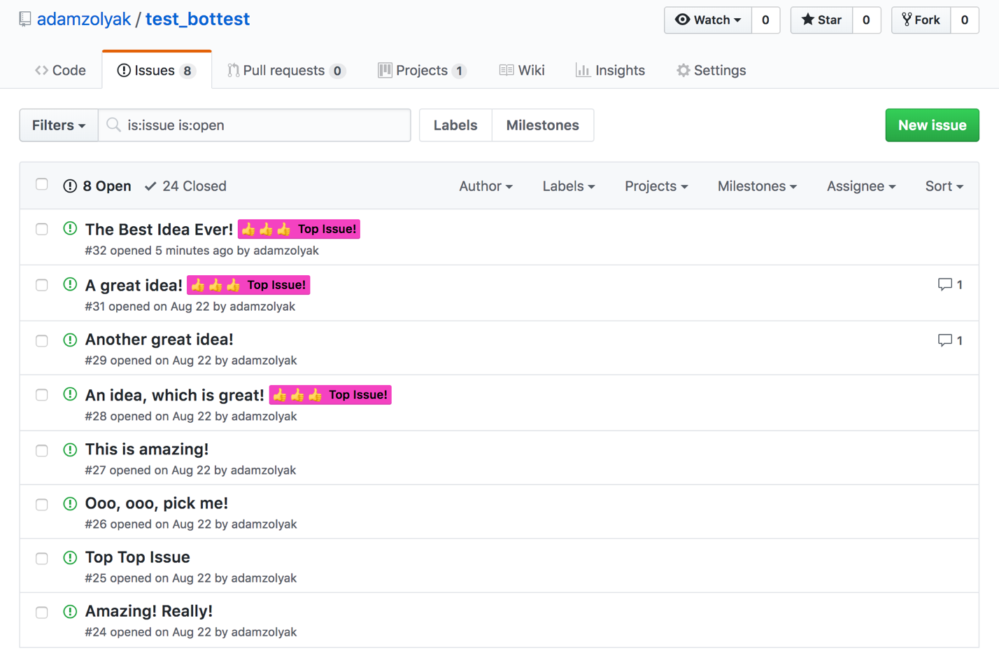
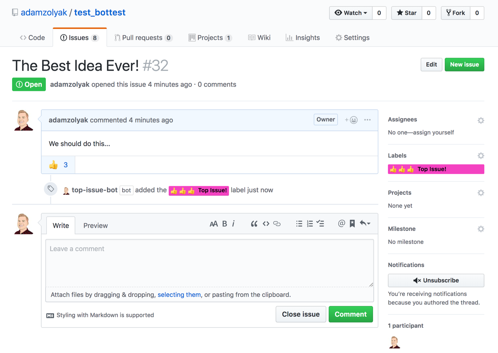

# 👍 Top Issues Labeler - GitHub Action (Work In Progress)

A [GitHub Action](https://github.com/features/actions) that labels issues with the most 👍s (+1s) in your repo.

## How It Works

This GitHub Action runs on a configurable schedule (cron) in your GitHub repo. The action labels top issues and unlabels issues that are no longer top issues. Top issues are issues with the most "+1" emoji reactions on the issue description. "+1" emoji reactions on issues comments are not considered. You must add a topissuebot.yml config to the .github directory in your repo for Top Issues to work.

## Examples

Example of label applied in issue list:


Example of label applied in issue detail:


## Installation

To use this GitHub Action, you must have access to [GitHub Actions](https://github.com/features/actions). GitHub Actions are currently only available in private beta (you must [apply for access](https://github.com/features/actions)) and only work in private repos.

To setup this action:

1. Create a `.github/main.workflow` in your GitHub repo.
2. Add the following code to the `main.workflow` file and commit it to the repo's `master` branch.

```
name: Label Top Issues

on:
  schedule:
  - cron:  '* * * * *'

jobs:
  labelTopIssues:
    name: Label Top Issues
    runs-on: ubuntu-latest
    steps:
    - uses: adamzolyak/top-issues-action@master
      with:
        args: "5" "Top Issue 2 3 4!" "f442c2"
```

3. Whenever you create an issue, the action will run!

## Contributing

If you have suggestions for how this GitHub Action could be improved, or want to report a bug, open an issue! Or pull request! We'd love all and any contributions. For more, check out the [Contributing Guide](CONTRIBUTING.md).

## License

[ISC](LICENSE) © 2018 Adam Zolyak <adam@tinkurlab.com> (www.tinkurlab.com)
